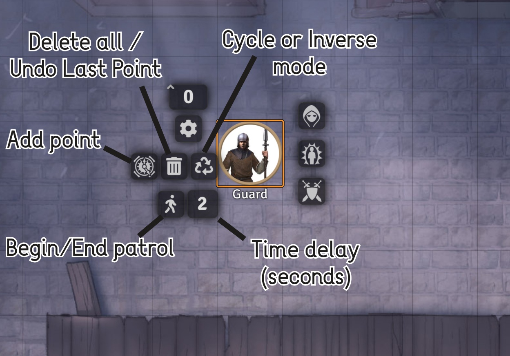
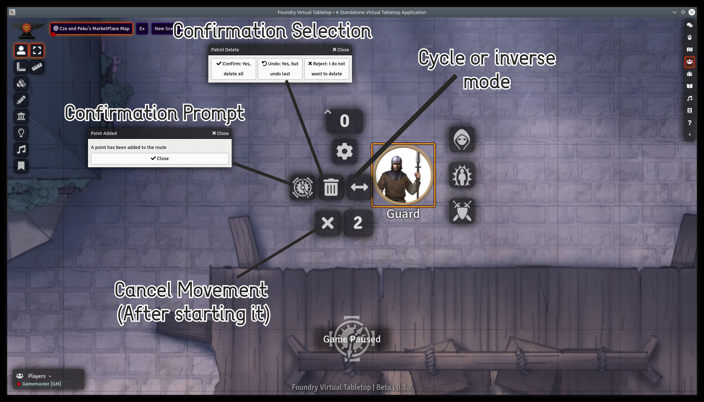

# Foundry Token Patrol
This module allows GMs (and optionally players) to set patrol points for their tokens, making the tokens move between the set points without input.

### Reasoning

Using this mod, you will be able to set up "Patrol Routes" which tokens will move to based on a timing of your choice. This can give certain scenes a more life like appearance! Make your markets full of life and give your castles that patrolling retinue they've always needed!

### FVTT Version
- Tested on FVTT v0.3.7

### IMPORTANT / BUGS

Bugs are inevitable, despite my best efforts to remove all that I could find. If you happen to locate any or if something doesn't appear to work as inteded, please don't hesitate to contact me on Discord at (JacobMcAuley#3461). I will correct the issue and push it out as soon as possible.

That being said here are all the known issues at the moment:
1. Group selecting tokens for deletion while patrolling is active *sometimes* results in an error message occuring. Hit F5 to refresh to fix.

### Installation Instructions

To install Foundry-patrol, do the following:

1. [Download the zip file]()
2. Extract the folder to your 'public/modules' in Foundry VTT.
3. Reload your application.

Auto-Installation Instructions:

1. Copy this link: 
2. Open FoundryVTT and navigate to Add-On Modules
3. Select "Install Module" and paste link into textbox.
4. Click "Install" and watch as the mod is installed!

### Usage

1. Download and install the mod, then enable it on Foundry.
2. Right click a token to view the tokenHUD.
3. Refer to the following image for descriptions of icons.

### Feedback

If you have any suggestions, please let me know on discord! (JacobMcAuley#3461)

### Attributions

Linear Walk found at: https://www.iconfinder.com/icons/214663/arrow_points_icon
Normal Walk found at: https://www.iconfinder.com/icons/2639849/chart_line_icon