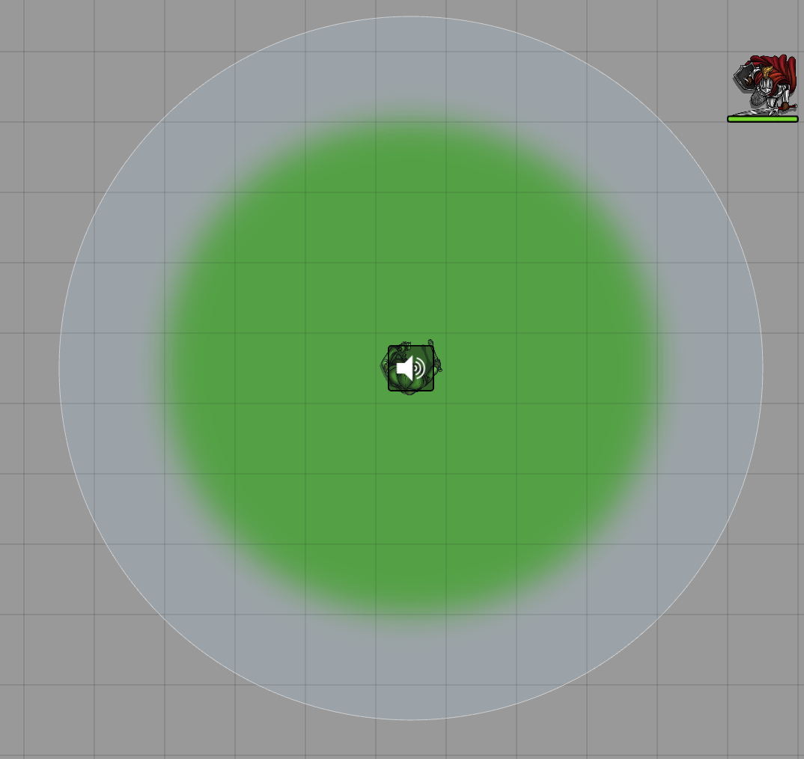

# IMPORTANT NOTE
This project is no longer being developed or worked on.

# Foundry Token Patrol

This module allows GMs (and optionally players) to set patrol points for their tokens, making the tokens move between the set points without input. Foundry Patrol offers a wide variety of features! I highly recommend watching the linked video below for a demonstration. The video is long, but you're welcome to skip through it or watch it at max speed!

### Reasoning

Using this mod, you will be able to set up "Patrol Routes" which tokens will move to based on a timing of your choice. This can give certain scenes a more life like appearance! Make your markets full of life and give your castles that patrolling retinue they've always needed!

### WARNING (READ)

**Mod Incompatabilities:**
1. Search Anywhere (A solution will be out soon!)
2. Any module similar to above.

A lot of these features use calculations that may or may not be overwhelming to your computer. Please keep this in mind when using quotes/vision/audio with several tokens on one scene.

If your computer is capable of handling all the weight, by all means, please go wild!

### FVTT Version

-   Tested on FVTT v0.5.5
-   No known module incompatibilities.

### IMPORTANT / BUGS

**Remember to back up your world before using mods**

Bugs are inevitable, despite my best efforts to remove all that I could find. Especially because this update is adding a bunch of new features! If you happen to locate any or if something doesn't appear to work as intended, please don't hesitate to contact me on Discord at (JacobMcAuley#3461). I will correct the issue and push it out as soon as possible.

That being said here are all the known issues at the moment:

1. Group selecting tokens for deletion while patrolling is active _sometimes_ results in an error message occuring. Hit F5 to refresh to fix.
2. Games with two or more GM or assistant permissions will find unexpected behavior.

### It's a feature not a bug!

1. Tokens moving through linear mode on a diagonal may take an unexpect route to reach the point. This is how the function currently works. Future updates will adjust this.
2. Ungridded and hexagonal maps are prohibited from using linear(in between) node based pathing. Only square maps will allow for it.

### Features

Here is a quick TLDR of the features available in Foundry Patrol.

## Token Patrol Caret HUD

Access all the token related information within the caret HUD menu. Every individual token related settings can be adjusted or changed here.

## General Settings Tab

Clicking the above Caret will open the Settings Tab. From here you can make your token patroller speak, use vision features, and keep an Ambient Sound

## Quotes

With this setting, Patrolling tokens can make mentions towards NPCs and PCs depending on the enabled settings.

This mode requires that Token Vision is enabled, including setting the sight on the token itself, and the corresponding quotes settings enabled. This can be seen more in detail by using the module and reading the hints.

# Quote Parsing

If you'd like to add an additional layer of fun to your game, you can use the keyword **{token.name}** within your single quotes to substitute the first seen token within. See the image below!

**Note:** The single quote ---> **'** is used as the delimiting factor in seeing quotes. So if you put a quote like 'This isn **'** t fair!' an error will be thrown, as the parser would break this into {'This isn', 't fair <--- ERROR NO ENDING}

## Vision

Token Vision adds some important features to the token patrol module. Using this option allows for tokens to use their existing vision (meaning you have to have set vision up within the FOUNDRY CORE vision) to interact with objects while on patrol.

The options include

1. Enable/Disable vision checking
2. Other Token Vision mode --> Used to check for NPCS
3. Stop Patrol when Player is seen --> Does what it sounds like
4. Create Combat when Player is seen --> Does what it sounds like
5. Pause Game when Player is seen --> Does what it sounds like.

## Audio

Token Audio allows for you to create trailing ambient sound on your token patrols! This can create the affects of footsteps, growling, talking, or even a marching band!

## Generate Macros

By using the set hotkey in the module settings, highlighting the tokens you wish to use, you can create a macro that will automatically start (or stop if you adjust it) the patrols when press.

This is super useful when used in combination with [Furnace's](https://github.com/kakaroto/fvtt-module-furnace) advance macro features, so that you can use [TriggerHappy](https://github.com/kakaroto/fvtt-module-trigger-happy) to call the macro under certain triggers!

Perhaps your player tripped a tripwire and now the guards are on the way!

## API Access

API calling available: Namespaced under TP these are good for macros!

1. TP.tokenPatroller.startPatrol(delay: string, tokenId: string)
2. TP.tokenPatroller.stopPatrol(tokenId: string)
3. TP.tokenPatroller.addPlotPoint(tokenId: string) // Takes the tokens current position as a point.

### Installation Instructions

To install Foundry-patrol, do the following:

1. [Download the zip file](https://github.com/JacobMcAuley/foundry-patrol/archive/master.zip)
2. Extract the folder to your modules in Foundry VTT.
3. Reload your application.

Auto-Installation Instructions:

1. Copy this link: https://github.com/JacobMcAuley/foundry-patrol/raw/master/module.json
2. Open FoundryVTT and navigate to Add-On Modules
3. Select "Install Module" and paste link into textbox.
4. Click "Install" and watch as the mod is installed!

### Usage

1. Download and install the mod, then enable it on Foundry.
2. Right click a token to view the tokenHUD.
3. Refer to the following image for descriptions of icons.

### Optional Token HUD examples

This menu can be disabled with settings!

Watch the video:

### Feedback

If you have any suggestions, please let me know on discord! (JacobMcAuley#3461)

### Attributions

Azzurite's setting extender provided the necessary tools to allow for keybinding.

Linear Walk found at: https://www.iconfinder.com/icons/214663/arrow_points_icon
Normal Walk found at: https://www.iconfinder.com/icons/2639849/chart_line_icon

### Special Thanks

Super special thanks to Bazoop on discord! He was a willing participant to bad code. This special gratitude is also given to Cris
#6864 on Discord. Their feedback on bugs and issues helped to refine Token Patrol.

Special thanks to: Felix, Jasaplay, Moerill, Gen Kitty, Guaccamole, errational, and any others I missed for providing much needed feedback.

# Donations

If you liked this project and want to support future ones, consider donating!
This module and all previous and future modules, as always, will be free to use and download. Any donations are warmly received and appreciated!

